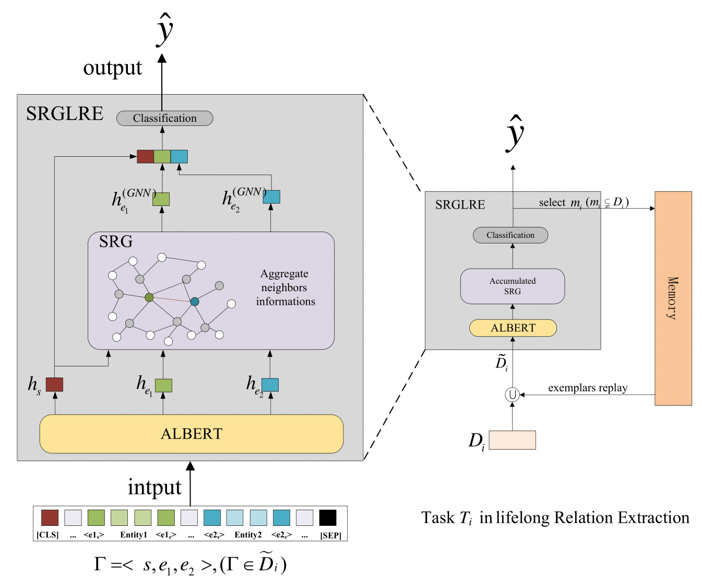

# SRGLHRE
## Model Architecture


## Dependencies

- perl (For evaluating official f1 score)
- python>=3.5
- torch>=1.1.0
- transformers>=2.3.0

## How to run
### Sem-Eval 2010 Task 8
```bash
python -u main.py \
    --task semeval \
    --model_type albert \
    --data_dir DATA_PATH \
    --do_train \
    --do_eval \
    --model_name_or_path MODEL_PATH \
    --entity_start 
```
### TACRED
```bash
python -u main.py \
    --task tacred \
    --model_type albert \
    --data_dir DATA_PATH \
    --do_train \
    --do_eval \
    --model_name_or_path MODEL_PATH \
    --entity_start
```

## Parameters


| Parameters| Description|
|--|--|
| --task | the name of task|
|--model_type             |the name of pre-trained model|
|--data_dir               |the path of data|
|--do_train               |train the model|
|--do_eval                |evaluate the model|
|--model_name_or_path     |the path of the model to load|
|--entity_start           |use the hidden state of start markers <e1s> and <e2s> as the representation|

## data
For Sem-Eval 2010 task 8 dataset, we provide it at ./data/semeval.

For TACRED dataset, we are unable to provide the data due to copyright. You can get the data from [TAC Relation Extraction Dataset](https://catalog.ldc.upenn.edu/LDC2018T24). And we provide dataset preprocess code at ./data/tacred

## Lifelong code
In the "master" branch, we provide the code for relation extraction without lifelong learning. While the code for lifelong extraction is at "lifelong" branch.
